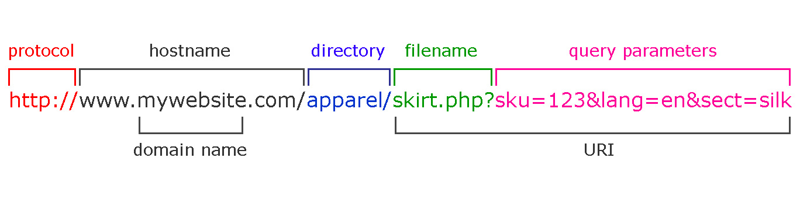

# Intro JS
## Working W/ APIs


## Link Structure



## Web Working

What happens when you go to https://google.com...

* A thorough response: [Alex Explains](https://github.com/alex/what-happens-when)


At a high level you have the protocol "https" followed by the domain name "google.com" of the server and a resource path "/".

This gets turned into a dns IP lookup for `google.com`, something like `172.217.6.206`. Then after a connection is made to the server an HTTP request message is sent.

```
GET / HTTP/1.1
Host google.com

```

Google then responds back over the connection and sends it's html for the `/` resource.

```
HTTP/1.1 301 Moved Permanently
Location: https://www.google.com/
Content-Type: text/html; charset=UTF-8
Date: Tue, 28 Mar 2017 19:08:21 GMT
Expires: Thu, 27 Apr 2017 19:08:21 GMT
Cache-Control: public, max-age=2592000
Server: gws
Content-Length: 220
X-XSS-Protection: 1; mode=block
X-Frame-Options: SAMEORIGIN
Alt-Svc: quic=":443"; ma=2592000; v="37,36,35"

<HTML><HEAD><meta http-equiv="content-type" content="text/html;charset=utf-8">
<TITLE>301 Moved</TITLE></HEAD><BODY>
<H1>301 Moved</H1>
The document has moved
<A HREF="https://www.google.com/">here</A>.
</BODY></HTML>
```


Which tells the browser, go do this request all over again for the provided location,  `www.google.com`.

## An Example API

Let's go to OMDB's API and give it a look.

If I want to request a movie by **title**. I just add a query parameter `t=matrix`.

[matrix request](https://www.omdbapi.com/?t=matrix)

```
https://www.omdbapi.com/?t=matrix
```

* What is the protocol of this request?
* What is the domain name?
* What is the query?
* What parameters are there?


`matrix response`

```json
// 20170328154423
// https://www.omdbapi.com/?t=matrix

{
  "Title": "Matrix",
  "Year": "1993–",
  "Rated": "N/A",
  "Released": "01 Mar 1993",
  "Runtime": "60 min",
  "Genre": "Action, Drama, Fantasy",
  "Director": "N/A",
  "Writer": "Grenville Case",
  "Actors": "Nick Mancuso, Phillip Jarrett, Carrie-Anne Moss, John Vernon",
  "Plot": "Steven Matrix is one of the underworld's foremost hitmen until his luck runs out, and someone puts a contract out on him. Shot in the forehead by a .22 pistol, Matrix \"dies\" and finds ...",
  "Language": "English",
  "Country": "Canada",
  "Awards": "1 win.",
  "Poster": "N/A",
  "Metascore": "N/A",
  "imdbRating": "8.4",
  "imdbVotes": "99",
  "imdbID": "tt0106062",
  "Type": "series",
  "totalSeasons": "N/A",
  "Response": "True"
}
```

### Exercise

For each exercise record the response's movie Title and Description.

* What would the url look like to search for **Dexter**?
* How would you search for a Star Wars movie?
* How would you search for a Star Wars movie made in 1980?
* How would you search for a Star Wars tv series?
* How would you search for a Star Wars tv series made in 2014?


## Using Fetch

Fetch is the new experimental standard for easily making requests.

```
fetch("https://www.omdbapi.com/?t=the+matrix")
```

Try the above and check the nextwork tab.


```javascript
fetch("https://www.omdbapi.com/?t=the+matrix")
  .then(function (response) {
    // tell it to read the JSON.
    return response.json();
  })
  .then(function (data) {
    console.log(data);
  })
```


Alternatively you could also condense this a bit.


```javascript
fetch("https://www.omdbapi.com/?t=the+matrix")
  .then(function (response) {
    // read the JSON
    response.json().then(function (data) {
      // log the data
      console.log(data);
    });
  })
```


You might run into a CORS issue. To get around this you specify a mode of "cors".

```javascript
fetch("https://www.omdbapi.com/?t=the+matrix", { mode: "cors" })
```

* Console log your search data for a Star Wars movie.
* Console log your search data for a Star Wars movie made in 1980.
* Console log your search data for a Star Wars tv series.
* Console log your search data for a Star Wars tv series made in 2014.


## Promises

You might have noticed the use of the `.then` on the end of the fetch. This is just an aysnc structure that allows you to control the flow of your program as it awaits some event.

This is not unlike how we specify functions to await and do something on some user interactions: click, hover, etc.

The async thing we are awaiting in this case is the request's response from OMDB. Then when we call `response.json()` we are waiting for the response to be finished parsing from **text** to **JSON**.


See MDN promises to learn more.


### jQuery Request

If you don't like the `fetch` feature or you want to not rely upon experimental features you can add jQuery.


Just find a CDN link for jQuery's source. Then just add the following:


```javascript
$.get("https://www.omdbapi.com/?t=the+matrix").done(function (data) {
  console.log(data);
});
```

This is pretty cool because you just get access to the parsed data right away.

* Console log your search data for a Star Wars movie.
* Console log your search data for a Star Wars movie made in 1980.
* Console log your search data for a Star Wars tv series.
* Console log your search data for a Star Wars tv series made in 2014.


### Forms

When using forms you will need to be clear about a few things

* Clicking a button on a form will submit
* Hitting enter will trigger a click on a submit button

When you submit a form the browser will look for **method** and **action** attributes to make a request with the form data.

This is troublesome! We do not want our nice little one page app to reload and chances are we have not specify any of those attributes.


Hence when we use forms we will listen for a submit event and have to **prevent the browsers default behavior**.

```javascript
document.querySelector("#myForm").addEventListener("submit", function (event) {
  // We stop the default behavior for this event.
  event.preventDefault();
});
```


## Assessment

Using your knowledge of apis, events and objects try the following in JS Bin or Codepen.

* Add a form to your site with an id of `searchTitle` for the  input field

  ```html
  <input id="searchTitle" type="text">
  ```

* When the form is submitted create a search request using the searchTitle and fetch
  * Console log the response JSON
* Add jQuery and rewrite your request to use `$.get`.
* Create a #results div on your page
* Set the HTML of the #results to the title and description of the result you get back from OMDB.
  * Wrap your result in a `h2` and `p` tags for the title and description.


### Bonus

* Alert and don't run the request if the searchTitle is empty!
* Add a select and option fields for the type.
* Display the imdb rating of each result
* Add each search to an array of previousResults
  * Add a div called #previousResults
  * Each time someone runs a new search **map** over the previousResults and display each with its rating, title, description
* Add a new form #filterPrevious with a select tag for displaying the results in the following ways:
  * Search Order: the order they were searched in
  * Title: the alphabetical order of the title
  * IMDB rating: the imdb rating

### SUPER BONUS?

* Style it up and add CSS to make it look cool!
